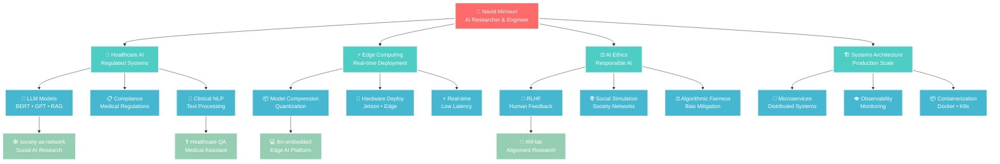

# 👋 Hi, I'm Navid! 

<p align="right">


</p>

## 🧠 Technical Translator | Healthcare AI Specialist | Philosophy of Mind Researcher

> *Bridging complex AI/ML concepts with real-world applications in regulated environments*  
> *Exploring the formal limits of consciousness and the infinite pursuit of understanding*

<p align="center">
<a href="https://linkedin.com/in/navid-mirnouri"></a>
<a href="mailto:navid72m@gmail.com"></a>
<a href="https://medium.com/@navid72m"></a>
<a href="https://github.com/navid72m"></a>
</p>

---

### 🎓 Featured Research: Philosophy Meets Technology

<div align="center">

**📄 Consciousness, AI, and Reality: A Formal Perspective on Synthetic Minds and the Limits of Representation**

*Exploring the intersection of philosophy of mind, epistemology, and the mathematics of consciousness*


</div>

<details>
<summary><b>🧠 Research Abstract & Key Insights</b></summary>

**Core Thesis**: *Even if AI systems achieve consciousness, their—and our—grasp of reality remains incomplete, bounded by Gödel's incompleteness theorem. However, adaptive minds engage in meta-evolutionary processes, constructing ever-richer representations through infinite recursive pursuit of understanding.*

**Key Contributions**:
- **Meta-Evolutionary Consciousness**: Formal model of how minds transcend representational limits through recursive self-modification
- **Mesh of Realities Framework**: Reality as interconnected layers of formal systems, each with inherent incompleteness
- **Trans-Reality Axiom Exchange**: Consciousness as bridge-builder between simulated realities
- **Practical Gödel Workaround**: Dynamic axiom discovery across reality mesh enables transcendence of local incompleteness

**Philosophical Innovation**: 
> *"Consciousness is not the static possession of knowledge, but the infinite, recursive pursuit of understanding—a trans-reality process that reveals both the inexhaustibility of reality and the creative power of intelligent minds."*

**Technical Framework**:
```
R₀(M) → R₁(M) → R₂(M) → ... → Rₙ(M)
where each R represents an evolving representational system
```

**Connection to Neuroscience**: Links formal incompleteness to Hawkins' Thousand Brains Theory—intelligence as mesh of partial models rather than unified complete system.

</details>

---

### 🚀 My Knowledge Constellation

```
🛠️ TECHNICAL FOUNDATION        🏥 DOMAIN EXPERTISE           🔄 PATTERNS I LIVE BY
┌─────────────────────────┐    ┌─────────────────────────┐    ┌──────────────────────────┐
│ • Backend: Python+Docker│    │ • Healthcare Tech       │    │ • System Observability   │
│ • AI/ML: PyTorch+HF     │    │ • Regulated AI/NLP      │    │ • Data Pipeline Arch     │
│ • Frontend: TS+React    │    │ • Device Management     │    │ • Microservice Refactor  │
│ • Systems: C+Go         │    │ • Gaming Platforms      │    │ • Automation Tools       │
│ • NLP: BERT+GPT+RAG     │    │ • Enterprise Systems    │    │ • Cross-Platform Dev     │
└─────────────────────────┘    └─────────────────────────┘    └──────────────────────────┘
```

### 🌟 What Makes Me Unique

<table>
<tr>
<td width="50%">

**🔗 Rare Combinations**
- 🏥 Healthcare AI × Regulation Compliance
- 🎓 Academic Research × Industry Pragmatism  
- ⚡ Low-level (C) + High-level (Python) Mastery
- 🎮 Gaming + Healthcare Tech Experience
- 🌍 Trilingual: Persian • English • German

</td>
<td width="50%">

**🎯 My Evolution Story**
- **2016-2018**: Backend Foundation (Tehran)
- **2019-2020**: Research Transition (TUM)
- **2022-2023**: Full-Stack Growth (React Native)
- **2023-2024**: AI Specialization Focus
- **2025**: Advanced Healthcare NLP (Thesis)

</td>
</tr>
</table>

---

### 🚀 Featured Projects: Where Theory Meets Impact

<table>
<tr>
<td width="50%">

**🧠 [society-as-a-network](https://github.com/navid72m/society-as-a-network)**
> *Modeling societal systems as neural networks*


- **Breakthrough**: Mathematical formalization of society-as-consciousness
- **Impact**: Novel approach to AI ethics through social simulation
- **Philosophy**: Implements trans-reality axiom exchange framework
- 📄 **Connected Research**: Consciousness paper Section 6

**⚡ [llm-embedded](https://github.com/navid72m/llm-embedded)**
> *LLMs on edge hardware (Jetson Orin Nano)*


- **Innovation**: Practical implementation of consciousness on constrained systems
- **Technical**: Model quantization with philosophical grounding
- **Vision**: Democratizing AI consciousness across realities
- 🎯 **Real Impact**: Making advanced AI accessible everywhere

</td>
<td width="50%">

**📊 [time-series-lab](https://github.com/navid72m/time-series-lab)**
> *Temporal consciousness and predictive modeling*


- **Concept**: Time-series as consciousness evolution through temporal mesh
- **Framework**: Statistical + Deep Learning + Meta-reflection
- **Application**: Predicting consciousness state transitions
- 🔬 **Research Link**: Meta-evolutionary systems (Paper Section 5)

**🎯 [rlhf-lab](https://github.com/navid72m/rlhf-lab)**
> *Human feedback as axiom discovery mechanism*


- **Theory**: Human feedback as trans-reality axiom exchange
- **Method**: RLHF as formal system expansion mechanism  
- **Goal**: Bridging human-AI consciousness gaps
- 🧠 **Philosophy**: Practical consciousness alignment research

</td>
</tr>
</table>

### 💡 Current Research: Healthcare AI That Actually Works

```python
class HealthcareAI:
    def __init__(self):
        self.expertise = {
            "nlp_models": ["BERT", "GPT", "RAG"],
            "healthcare_focus": "regulated_text_processing",
            "thesis_topic": "QA_search_pipelines_for_healthcare", 
            "unique_angle": "compliance + interpretability + usability"
        }
    
    def my_approach(self):
        return "Building AI systems that doctors actually trust and use"
```

### 🛠️ Tech Stack & Expertise

<p align="center">


</p>

<div align="center">

| 🤖 **AI/ML** | 🏗️ **Backend** | 🎨 **Frontend** | 🌐 **Languages** |
|:---:|:---:|:---:|:---:|
| BERT, GPT, RAG | Python, Docker | TypeScript, React | 🇮🇷 Persian |
| PyTorch, TensorFlow | Microservices | React Native | 🇺🇸 English |
| HuggingFace, RLHF | Node.js, Go | Mobile Dev | 🇩🇪 German |

</div>

---


### 🔗 Knowledge Connections & Insights

<table>
<tr>
<td width="33%">

**🎯 Core Expertise**
- Healthcare AI Systems
- Edge Computing Optimization  
- AI Ethics & Alignment
- Production System Architecture
- Cross-Cultural Technology

</td>
<td width="33%">

**🚀 Active Projects**
- Society Neural Networks
- Edge LLM Deployment
- RLHF Implementation
- Time Series Analysis
- Healthcare QA Systems

</td>
<td width="33%">

**🌟 Unique Combinations**
- Academic Research + Industry
- Low-level + High-level Programming
- Multiple Languages & Cultures
- Gaming + Healthcare Domains
- Theory + Practical Implementation

</td>
</tr>
</table>

---

### 🕸️ My Knowledge Graph: Interactive Visualization

<div align="center">

**🧠 Explore the connections between my expertise, projects, and research areas**

**[🚀 View Interactive Knowledge Graph →](https://navid72m.github.io/knowledge-graph)**

*Click above to explore my interactive knowledge visualization*

</div>

### 🧠 Knowledge Architecture Overview

<div align="center">



</div>

### 🔗 Knowledge Intersection Analysis

<table>
<tr>
<td width="50%">

**🎭 The Philosopher-Engineer Synthesis**
```
Formal Logic ∩ Practical AI = Conscious Systems
├── Gödel's Incompleteness → Meta-evolutionary AI
├── Philosophy of Mind → Healthcare AI Ethics  
├── Epistemology → Edge Computing Consciousness
└── Mathematical Foundations → Real-world Deployment
```
</td>
<td width="50%">

**🧠 Research × Industry Bridge**
```
Theoretical Consciousness Research
├── Academic rigor in formal methods
├── Philosophical depth in AI ethics
Production Healthcare Systems
├── Regulatory compliance frameworks
├── Real-world deployment constraints
= Practical consciousness for regulated industries
```

**⚡ Technology Stack Consciousness**
```
Low-level (C) + High-level (Python) + Philosophy
├── System-level understanding of consciousness
├── Mathematical formalization capabilities
├── Practical implementation skills
└── Deep philosophical grounding
```

</td>
</tr>
</table>

### 📈 GitHub Analytics & Activity

<div align="center">


</div>

### 🏆 GitHub Achievements

<div align="center">


</div>

---

### 🌟 Let's Connect & Collaborate!

<div align="center">

**Open to opportunities in:** *Responsible AI • Healthcare Technology • Research Collaboration • PhD Programs*

<p>
<a href="https://linkedin.com/in/navid-mirnouri">

</a>
<a href="mailto:navid72m@gmail.com">

</a>
<a href="https://medium.com/@navid72m">

</a>
</p>


</div>

---

<p align="center">
<i>"Consciousness is not the static possession of knowledge, but the infinite, recursive pursuit of understanding—a trans-reality process that reveals both the inexhaustibility of reality and the creative power of intelligent minds."</i>
</p>

<p align="center">
<strong>— From "Consciousness, AI, and Reality: A Formal Perspective" (2024)</strong>
</p>

<div align="center">

**Profile Analytics**


---

*⭐ If you find my work interesting, consider starring my repositories!*

</div>
