# 👋 Hi, I'm Navid! 

<p align="right">


</p>

## 🧠 Technical Translator | Healthcare AI Specialist | Systems Optimizer

> *Bridging complex AI/ML concepts with real-world applications in regulated environments*

<p align="center">
<a href="https://linkedin.com/in/navid-mirnouri"></a>
<a href="mailto:navid72m@gmail.com"></a>
<a href="https://medium.com/@navid72m"></a>
<a href="https://github.com/navid72m"></a>
</p>

---

### 🚀 My Knowledge Constellation

```
🛠️ TECHNICAL FOUNDATION        🏥 DOMAIN EXPERTISE           🔄 PATTERNS I LIVE BY
┌─────────────────────────┐    ┌─────────────────────────┐    ┌──────────────────────────┐
│ • Backend: Python+Docker│    │ • Healthcare Tech       │    │ • System Observability   │
│ • AI/ML: PyTorch+HF     │    │ • Regulated AI/NLP      │    │ • Data Pipeline Arch     │
│ • Frontend: TS+React    │    │ • Device Management     │    │ • Microservice Refactor  │
│ • Systems: C+Go         │    │ • Gaming Platforms      │    │ • Automation Tools       │
│ • NLP: BERT+GPT+RAG     │    │ • Enterprise Systems    │    │ • Cross-Platform Dev     │
└─────────────────────────┘    └─────────────────────────┘    └──────────────────────────┘
```

### 🌟 What Makes Me Unique

<table>
<tr>
<td width="50%">

**🔗 Rare Combinations**
- 🏥 Healthcare AI × Regulation Compliance
- 🎓 Academic Research × Industry Pragmatism  
- ⚡ Low-level (C) + High-level (Python) Mastery
- 🎮 Gaming + Healthcare Tech Experience
- 🌍 Trilingual: Persian • English • German

</td>
<td width="50%">

**🎯 My Evolution Story**
- **2016-2018**: Backend Foundation (Tehran)
- **2019-2020**: Research Transition (TUM)
- **2022-2023**: Full-Stack Growth (React Native)
- **2023-2024**: AI Specialization Focus
- **2025**: Advanced Healthcare NLP (Thesis)

</td>
</tr>
</table>

---

### 🚀 Featured Projects: Where Theory Meets Impact

<table>
<tr>
<td width="50%">

**🧠 [society-as-a-network](https://github.com/navid72m/society-as-a-network)**
> *Modeling societal systems as neural networks*


- Deep Learning + Reinforcement Learning for social simulation
- Focus: Balancing fairness, efficiency, and meritocracy
- Keywords: Social Simulation, Ethics in AI
- 📄 Paper draft available on request

**⚡ [llm-embedded](https://github.com/navid72m/llm-embedded)**
> *LLMs on edge hardware (Jetson Orin Nano)*


- Model quantization, compression & distillation
- Hardware-aware design for real-world deployment
- Focus: Efficient inference, low-latency systems

</td>
<td width="50%">

**📊 [time-series-lab](https://github.com/navid72m/time-series-lab)**
> *End-to-end time series analysis framework*


- Statistical + Deep Learning approaches
- Production-ready visualization pipelines
- Tools: Prophet, ARIMA, LSTM

**🎯 [rlhf-lab](https://github.com/navid72m/rlhf-lab)**
> *Human feedback → Better AI behavior*


- Reinforcement Learning from Human Feedback
- Policy optimization experiments
- Reward model training & evaluation

</td>
</tr>
</table>

### 💡 Current Research: Healthcare AI That Actually Works

```python
class HealthcareAI:
    def __init__(self):
        self.expertise = {
            "nlp_models": ["BERT", "GPT", "RAG"],
            "healthcare_focus": "regulated_text_processing",
            "thesis_topic": "QA_search_pipelines_for_healthcare", 
            "unique_angle": "compliance + interpretability + usability"
        }
    
    def my_approach(self):
        return "Building AI systems that doctors actually trust and use"
```

### 🛠️ Tech Stack & Expertise

<p align="center">


</p>

<div align="center">

| 🤖 **AI/ML** | 🏗️ **Backend** | 🎨 **Frontend** | 🌐 **Languages** |
|:---:|:---:|:---:|:---:|
| BERT, GPT, RAG | Python, Docker | TypeScript, React | 🇮🇷 Persian |
| PyTorch, TensorFlow | Microservices | React Native | 🇺🇸 English |
| HuggingFace, RLHF | Node.js, Go | Mobile Dev | 🇩🇪 German |

</div>

---

### 🧠 Knowledge Architecture Overview

```mermaid
graph TD
    A[Navid Mirnouri<br/>🧠 AI Researcher] --> B[Healthcare AI<br/>🏥]
    A --> C[Edge Computing<br/>⚡]
    A --> D[AI Ethics<br/>⚖️]
    A --> E[Systems Architecture<br/>🏗️]
    
    B --> F[BERT/GPT Models<br/>🤖]
    B --> G[Regulatory Compliance<br/>📋]
    B --> H[Clinical NLP<br/>📄]
    
    C --> I[Model Compression<br/>📦]
    C --> J[Jetson Deployment<br/>🔧]
    C --> K[Real-time Inference<br/>⚡]
    
    D --> L[RLHF Research<br/>🎯]
    D --> M[Social Simulation<br/>🌐]
    D --> N[Fairness Algorithms<br/>⚖️]
    
    E --> O[Microservices<br/>🔗]
    E --> P[Observability<br/>👁️]
    E --> Q[Docker/K8s<br/>📦]
    
    F --> R[society-as-network<br/>🕸️]
    I --> S[llm-embedded<br/>💻]
    L --> T[rlhf-lab<br/>🔬]
    H --> U[Healthcare QA<br/>❓]
    
    style A fill:#ff6b6b,stroke:#fff,stroke-width:3px
    style B fill:#4ecdc4,stroke:#fff,stroke-width:2px
    style C fill:#45b7d1,stroke:#fff,stroke-width:2px
    style D fill:#96ceb4,stroke:#fff,stroke-width:2px
    style E fill:#feca57,stroke:#fff,stroke-width:2px
```

<div align="center">



</div>

### 🔗 Knowledge Connections & Insights

<table>
<tr>
<td width="33%">

**🎯 Core Expertise**
- Healthcare AI Systems
- Edge Computing Optimization  
- AI Ethics & Alignment
- Production System Architecture
- Cross-Cultural Technology

</td>
<td width="33%">

**🚀 Active Projects**
- Society Neural Networks
- Edge LLM Deployment
- RLHF Implementation
- Time Series Analysis
- Healthcare QA Systems

</td>
<td width="33%">

**🌟 Unique Combinations**
- Academic Research + Industry
- Low-level + High-level Programming
- Multiple Languages & Cultures
- Gaming + Healthcare Domains
- Theory + Practical Implementation

</td>
</tr>
</table>

---

### 🕸️ My Knowledge Graph: Interactive Visualization

<div align="center">

**🧠 Explore the connections between my expertise, projects, and research areas**

</div>

<details>
<summary><b>🎯 Click to View Interactive Knowledge Graph</b></summary>

```html
<!DOCTYPE html>
<html>
<head>
    <script src="https://cdnjs.cloudflare.com/ajax/libs/d3/7.8.5/d3.min.js"></script>
    <style>
        .knowledge-graph {
            width: 100%;
            height: 600px;
            border: 2px solid #e2e8f0;
            border-radius: 12px;
            background: linear-gradient(135deg, #667eea 0%, #764ba2 100%);
            position: relative;
            overflow: hidden;
        }
        .node-core { fill: #ff6b6b; stroke: #fff; stroke-width: 3px; }
        .node-tech { fill: #4ecdc4; stroke: #fff; stroke-width: 2px; }
        .node-domain { fill: #45b7d1; stroke: #fff; stroke-width: 2px; }
        .node-project { fill: #96ceb4; stroke: #fff; stroke-width: 2px; }
        .node-skill { fill: #feca57; stroke: #fff; stroke-width: 2px; }
        .link { stroke: #ffffff; stroke-opacity: 0.6; stroke-width: 2px; }
        .link-strong { stroke-width: 4px; stroke: #ff6b6b; }
        .node-text { 
            font-family: 'Arial', sans-serif; 
            font-size: 12px; 
            font-weight: bold;
            fill: #2c3e50;
            text-anchor: middle;
            pointer-events: none;
        }
        .legend {
            position: absolute;
            top: 10px;
            right: 10px;
            background: rgba(255,255,255,0.9);
            padding: 15px;
            border-radius: 8px;
            font-size: 12px;
        }
        .legend-item {
            display: flex;
            align-items: center;
            margin: 5px 0;
        }
        .legend-color {
            width: 20px;
            height: 20px;
            border-radius: 50%;
            margin-right: 8px;
            border: 2px solid #fff;
        }
    </style>
</head>
<body>
    <div class="knowledge-graph" id="knowledge-graph">
        <div class="legend">
            <div class="legend-item">
                <div class="legend-color" style="background: #ff6b6b;"></div>
                <span>Core Identity</span>
            </div>
            <div class="legend-item">
                <div class="legend-color" style="background: #4ecdc4;"></div>
                <span>Technologies</span>
            </div>
            <div class="legend-item">
                <div class="legend-color" style="background: #45b7d1;"></div>
                <span>Domains</span>
            </div>
            <div class="legend-item">
                <div class="legend-color" style="background: #96ceb4;"></div>
                <span>Projects</span>
            </div>
            <div class="legend-item">
                <div class="legend-color" style="background: #feca57;"></div>
                <span>Skills</span>
            </div>
        </div>
    </div>

    <script>
        // Knowledge Graph Data
        const nodes = [
            // Core Identity
            { id: "navid", name: "Navid\nMirnouri", type: "core", size: 25 },
            
            // Technologies
            { id: "python", name: "Python", type: "tech", size: 20 },
            { id: "pytorch", name: "PyTorch", type: "tech", size: 18 },
            { id: "bert", name: "BERT", type: "tech", size: 16 },
            { id: "gpt", name: "GPT", type: "tech", size: 16 },
            { id: "docker", name: "Docker", type: "tech", size: 15 },
            { id: "typescript", name: "TypeScript", type: "tech", size: 15 },
            { id: "react", name: "React\nNative", type: "tech", size: 14 },
            { id: "golang", name: "Go", type: "tech", size: 14 },
            { id: "c", name: "C", type: "tech", size: 12 },
            
            // Domains
            { id: "healthcare", name: "Healthcare\nAI", type: "domain", size: 20 },
            { id: "nlp", name: "Natural\nLanguage\nProcessing", type: "domain", size: 18 },
            { id: "rlhf", name: "RLHF", type: "domain", size: 16 },
            { id: "edge-ai", name: "Edge AI", type: "domain", size: 16 },
            { id: "ethics", name: "AI Ethics", type: "domain", size: 15 },
            { id: "social-sim", name: "Social\nSimulation", type: "domain", size: 15 },
            
            // Projects
            { id: "society-network", name: "Society as\nNetwork", type: "project", size: 18 },
            { id: "llm-embedded", name: "LLM\nEmbedded", type: "project", size: 17 },
            { id: "time-series", name: "Time Series\nLab", type: "project", size: 16 },
            { id: "rlhf-lab", name: "RLHF\nLab", type: "project", size: 16 },
            { id: "healthcare-qa", name: "Healthcare\nQA System", type: "project", size: 15 },
            
            // Skills
            { id: "research", name: "Research", type: "skill", size: 16 },
            { id: "systems", name: "Systems\nThinking", type: "skill", size: 15 },
            { id: "observability", name: "Observability", type: "skill", size: 14 },
            { id: "multilingual", name: "Trilingual", type: "skill", size: 13 },
            { id: "mentoring", name: "Mentoring", type: "skill", size: 12 },
            { id: "cross-cultural", name: "Cross-Cultural", type: "skill", size: 12 }
        ];

        const links = [
            // Core connections
            { source: "navid", target: "healthcare", strength: "strong" },
            { source: "navid", target: "nlp", strength: "strong" },
            { source: "navid", target: "ethics", strength: "strong" },
            { source: "navid", target: "research", strength: "strong" },
            
            // Technology connections
            { source: "healthcare", target: "bert", strength: "normal" },
            { source: "healthcare", target: "gpt", strength: "normal" },
            { source: "healthcare", target: "python", strength: "normal" },
            { source: "nlp", target: "bert", strength: "strong" },
            { source: "nlp", target: "gpt", strength: "strong" },
            { source: "nlp", target: "pytorch", strength: "normal" },
            
            // Project connections
            { source: "society-network", target: "social-sim", strength: "strong" },
            { source: "society-network", target: "ethics", strength: "strong" },
            { source: "society-network", target: "python", strength: "normal" },
            { source: "llm-embedded", target: "edge-ai", strength: "strong" },
            { source: "llm-embedded", target: "pytorch", strength: "normal" },
            { source: "time-series", target: "python", strength: "normal" },
            { source: "rlhf-lab", target: "rlhf", strength: "strong" },
            { source: "rlhf-lab", target: "ethics", strength: "normal" },
            { source: "healthcare-qa", target: "healthcare", strength: "strong" },
            { source: "healthcare-qa", target: "nlp", strength: "strong" },
            
            // Skill connections
            { source: "research", target: "systems", strength: "normal" },
            { source: "observability", target: "docker", strength: "normal" },
            { source: "multilingual", target: "cross-cultural", strength: "normal" },
            { source: "cross-cultural", target: "ethics", strength: "normal" },
            
            // Technology interconnections
            { source: "python", target: "pytorch", strength: "normal" },
            { source: "typescript", target: "react", strength: "normal" },
            { source: "docker", target: "observability", strength: "normal" },
            
            // Domain connections
            { source: "healthcare", target: "ethics", strength: "normal" },
            { source: "edge-ai", target: "pytorch", strength: "normal" },
            { source: "rlhf", target: "ethics", strength: "strong" }
        ];

        // Set up the visualization
        const width = 800;
        const height = 600;
        
        const svg = d3.select("#knowledge-graph")
            .append("svg")
            .attr("width", width)
            .attr("height", height);

        // Create simulation
        const simulation = d3.forceSimulation(nodes)
            .force("link", d3.forceLink(links).id(d => d.id).distance(80))
            .force("charge", d3.forceManyBody().strength(-300))
            .force("center", d3.forceCenter(width / 2, height / 2))
            .force("collision", d3.forceCollide().radius(d => d.size + 5));

        // Create links
        const link = svg.append("g")
            .selectAll("line")
            .data(links)
            .enter().append("line")
            .attr("class", d => d.strength === "strong" ? "link link-strong" : "link");

        // Create nodes
        const node = svg.append("g")
            .selectAll("circle")
            .data(nodes)
            .enter().append("circle")
            .attr("r", d => d.size)
            .attr("class", d => `node-${d.type}`)
            .call(d3.drag()
                .on("start", dragstarted)
                .on("drag", dragged)
                .on("end", dragended));

        // Add labels
        const labels = svg.append("g")
            .selectAll("text")
            .data(nodes)
            .enter().append("text")
            .attr("class", "node-text")
            .text(d => d.name)
            .style("font-size", d => `${Math.max(10, d.size/2)}px`);

        // Add hover effects
        node.on("mouseover", function(event, d) {
            d3.select(this).transition().duration(200).attr("r", d.size * 1.3);
        }).on("mouseout", function(event, d) {
            d3.select(this).transition().duration(200).attr("r", d.size);
        });

        // Update positions
        simulation.on("tick", () => {
            link
                .attr("x1", d => d.source.x)
                .attr("y1", d => d.source.y)
                .attr("x2", d => d.target.x)
                .attr("y2", d => d.target.y);

            node
                .attr("cx", d => d.x)
                .attr("cy", d => d.y);
                
            labels
                .attr("x", d => d.x)
                .attr("y", d => d.y + 5);
        });

        // Drag functions
        function dragstarted(event, d) {
            if (!event.active) simulation.alphaTarget(0.3).restart();
            d.fx = d.x;
            d.fy = d.y;
        }

        function dragged(event, d) {
            d.fx = event.x;
            d.fy = event.y;
        }

        function dragended(event, d) {
            if (!event.active) simulation.alphaTarget(0);
            d.fx = null;
            d.fy = null;
        }
    </script>
</body>
</html>
```

**🎮 Interactive Features:**
- **Drag nodes** to explore relationships
- **Hover effects** for better visibility  
- **Color coding** by expertise type
- **Connection strength** visualization
- **Responsive design** for different screens

</details>

### 📈 GitHub Analytics & Activity

<div align="center">


</div>

### 🏆 GitHub Achievements

<div align="center">


</div>

---

### 🌟 Let's Connect & Collaborate!

<div align="center">

**Open to opportunities in:** *Responsible AI • Healthcare Technology • Research Collaboration • PhD Programs*

<p>
<a href="https://linkedin.com/in/navid-mirnouri">

</a>
<a href="mailto:navid72m@gmail.com">

</a>
<a href="https://medium.com/@navid72m">

</a>
</p>


</div>

---

<p align="center">
<i>"The most impactful AI systems are those that understand both the technical complexity and the human context they serve."</i>
</p>

<div align="center">

**Profile Analytics**


---

*⭐ If you find my work interesting, consider starring my repositories!*

</div>
